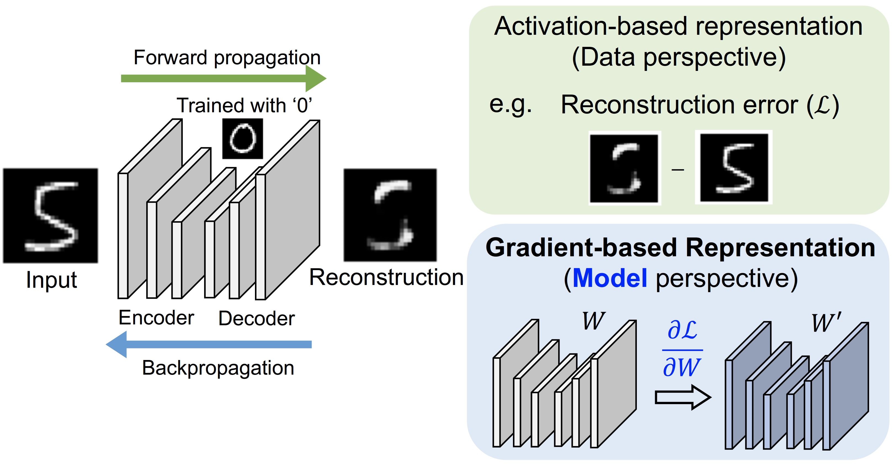

# Backpropagated Gradient Representations for Anomaly Detection

This work was conducted in the [OLIVES @ Georgia Institute of Technology](http://www.ghassanalregib.info)

This is an official code repository for the paper:

[Gukyeong Kwon](https://https://gukyeongkwon.github.io/), [Mohit Prabhushankar](https://www.linkedin.com/in/mohitps/), [Dogancan Temel](http://cantemel.com/), and [Ghassan AlRegib](http://www.ghassanalregib.info), "Backpropagated Gradient Representations for Anomaly Detection," In Proceedings of the European Conference on Computer Vision (ECCV), 2020.

If you find our codes useful, we kindly ask you to cite our work. 
```tex
@inproceedings{kwon2020backpropagated,
  title={Backpropagated Gradient Representations for Anomaly Detection},
  author={Kwon, Gukyeong and Prabhushankar, Mohit and Temel, Dogancan and AlRegib, Ghassan},
  booktitle={Proceedings of the European Conference on Computer Vision (ECCV)},
  year={2020}
}
```
--------

## Abstract

Learning representations that clearly distinguish between normal and abnormal data is key to the success of anomaly detection. Most of existing anomaly detection algorithms use activation representations from forward propagation while not exploiting gradients from backpropagation to characterize data. Gradients capture model updates required to represent data. Anomalies require more drastic updates to models to fully represent them compared to normal data. Hence, we propose the utilization of backpropagated gradients as representations to characterize model behavior on anomalies and, consequently, detect such anomalies. We show that the proposed method using gradient-based representations achieves state-of-the-art anomaly detection performance in benchmarking image recognition datasets. Also, we highlight the computational efficiency and the simplicity of the proposed method by comparing with other state-of-the-art methods relying on adversarial networks or autoregressive models, which require at least 27 times more model parameters than the proposed method. 

<p align="center">

</p>

## Getting Started

### Set up the environment
Clone this repository and run following commands to create a conda environment and install all dependencies.
```
conda create -n gradcon python=3.6
conda activate gradcon
cd gradcon-anomaly
conda install pytorch torchvision -c pytorch
pip install -r requirments.txt
```

### Prepare datasets
Run prep_dataset.py to download datasets and create train/val/test splits as follows:
```
python prep_datasets.py --dataset 'cifar-10' --save_dir ./datasets
``` 

```
usage: prep_datasets.py [-h] [--dataset DATASET] [--save_dir SAVE_DIR]

Download datasets and create splits

optional arguments:
  -h, --help           show this help message and exit
  --dataset DATASET    Dataset to be downloaded (e.g. cifar-10, mnist)
  --save_dir SAVE_DIR  Path to save the data
```
To download CURE-TSR dataset, please visit [this repository](https://github.com/olivesgatech/CURE-TSR). 

## Training and Evaluation of GradCon
Run following commands:
### Training
```
python train.py --dataset 'cifar-10' --dataset_dir './datasets' --save_dir './save'  --save_name 'GradConCAE'
``` 

### Evaluation
```
python eval.py --dataset 'cifar-10' --dataset_dir './datasets'  --ckpt_dir './save' --ckpt_name 'GradConCAE' --output_dir './results'
```

## Questions?

If you have any questions, regarding the dataset or the code, you can contact the authors (gukyeong.kwon@gatech.edu or mohit.p@gatech.edu), or even better open an issue in this repo and we'll do our best to help.

